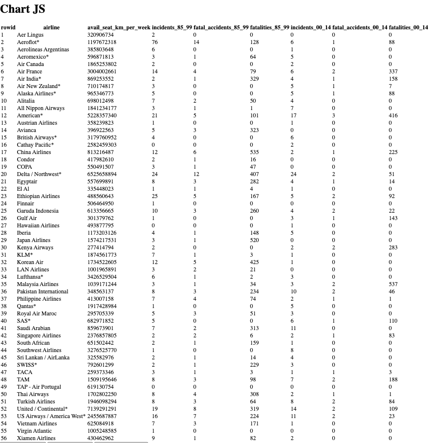
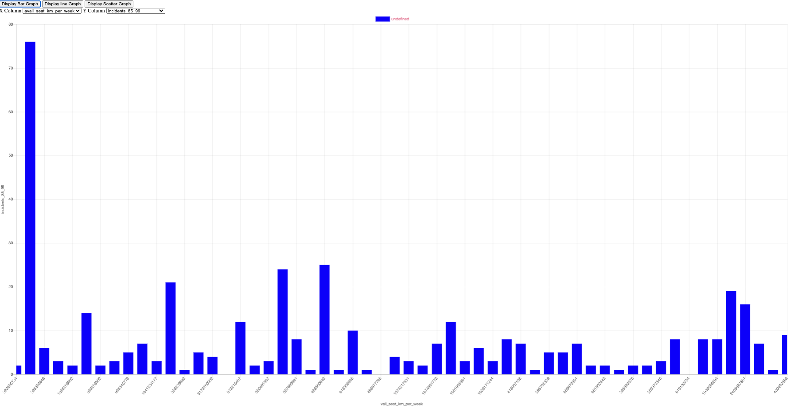
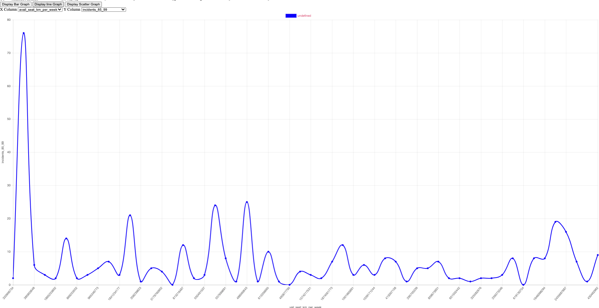
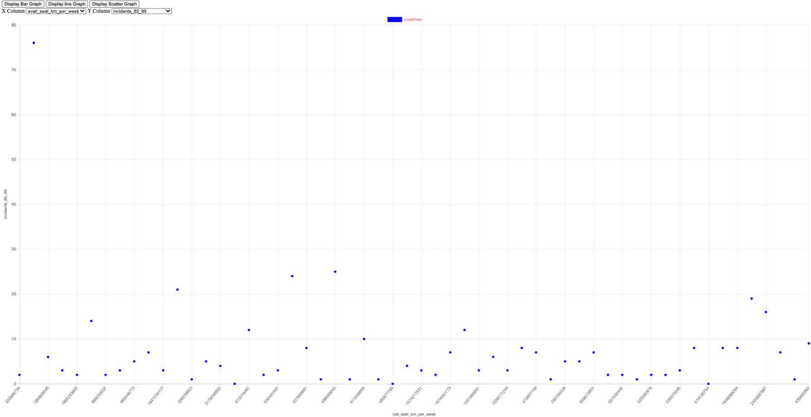
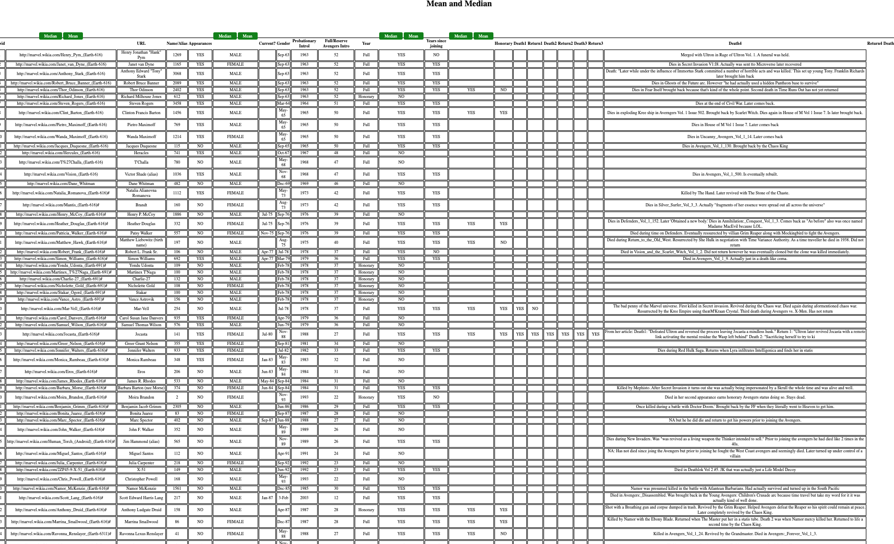
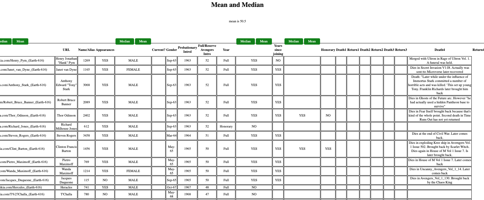
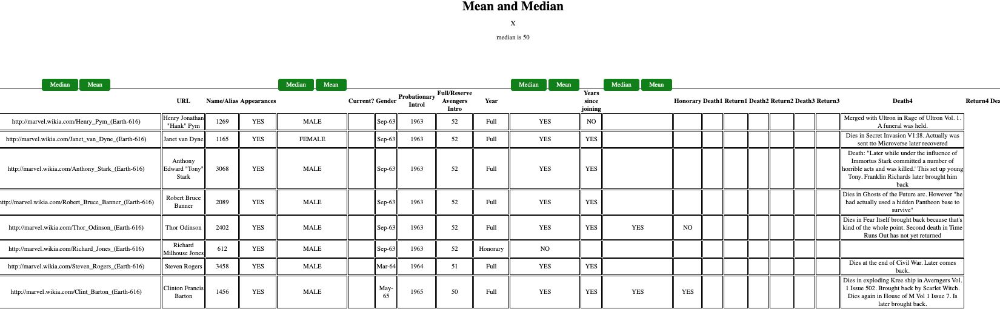

# Chart.js Plugin as a framework-agnostic JavaScript plugin
# Core Functionality for Mean And Median.
 
I decided to tackle this assessment by trying to create a framework-agnostic Javascript, that could work without the need of context of a framework.   

## Chart-js-component

For the first part of this assessment you can find the code in the folder <strong> first_option </strong> 
 

This file shows how to manipulate Chart js by attempting to create a Javascript plugin

### Getting Started
- Get started by downloading the content of this repo. There are two main files of concert. <strong> chart-js-component.js </strong> and <strong> index.html </strong>
- Link the js file, and have the boiler plate from the html file for this to work. 
 
You will see in the index.html file, a script space for the assignation of the url

### Using the plugin
The plugin works by creating a table to display the information, and creating graphs as per the use of the data

### Documentation / comments 
 - I left many comments along the code to explain the steps taken on each aspect of the process. 
 - I trully wanted to create the plugin in a dynamic way, so the information can be render from any url, and the graphs will display the information as such.
 - I have no included any validations regarding the url, as this is more of a general approach as to how I will try to create the plugin, rather than a code ready for shipping.
  
As in right now I am able to render the information on a table, and able to graph it using the user's input as to the type of graph. 
  

 

 

 

  
## Core Functionality Mean Median

For the second part of this assessment you can find the code in the folder <strong> second_option </strong> 
 

### Getting Started
- Get started by downloading the content of this repo. There are two main files of concert. <strong> median-mean-component.js </strong> and <strong> main.html </strong>
- Link the js file, and have the boiler plate from the html file for this to work. 
 
You will see in the main.html file, a script space for the assignation of the url

### Using the plugin / Core functionalities
The plugin works by creating a table to display the information, and creating the options of <strong>Median </strong> and <strong> Mean </strong>

### Dcoumentation / comments 

- I have left many comments along the code to explain the steps taken on each aspect of the process 
- Again, just as with the first option, I wanted to make functions and helpers mainly dinamically with the use of loops, and calling on things by the index and keys / values, to avoid the use of static variables. However this was hard, and I did had to use some static variables. 
- There are no validations for the data collected from the url, but the ideas on how to go about each function are explain in great detail.
- I used my way of interpretation to collect the values only for the mean, and the median.
- Such values are displayed at top of the table just as shown below. 
- At the moment I attempted to work on the close button function, to hide or remove the information once the button is clicked, but I couldn't get it to work with the amount of time provided. 
- I would have been able to do such thing, but using static variables, and it is my undestanding that I needed to restrain myself from going that route.
- I implemented the <strong>mean</strong> and <strong>median</strong> on the columns with int values only.
  

 

 

 

